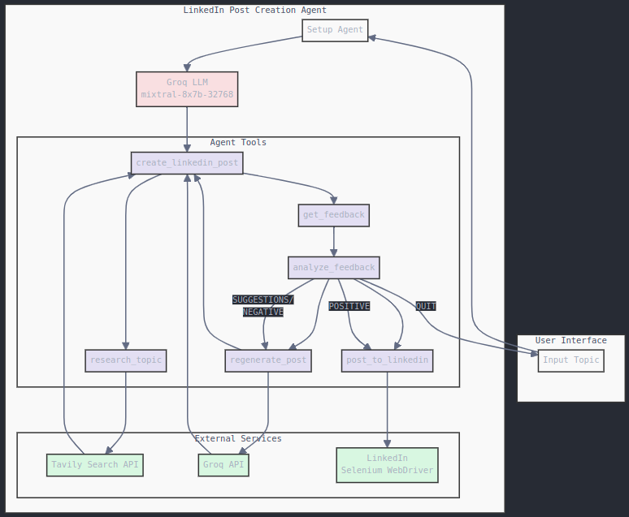

# LinkedIn Post Creation Agent 🤖

An intelligent agent that helps create, refine, and automatically post content to LinkedIn using LLM technology and automated browser interactions.

## 🌟 Features

- **Intelligent Post Generation**: Uses Groq LLM (mixtral-8x7b-32768) to create engaging LinkedIn posts
- **Real-time Research**: Integrates with Tavily API for current information and trends
- **Interactive Feedback Loop**: Collects and analyzes user feedback for post improvement
- **Automated Posting**: Handles LinkedIn interactions using Selenium WebDriver
- **Modular Architecture**: Built with LangChain's ReAct agent pattern for extensibility

## 📋 Prerequisites

- Python 3.11.11
- Chrome Browser (for Selenium WebDriver)
- LinkedIn Account
- Required API Keys:
  - Groq API Key
  - Tavily API Key

## 🚀 Installation

1. Clone the repository:
```bash
git clone https://github.com/SuyodhanJ6/linkedInPostAgent.git
cd shantabaiagent
```

2. Install dependencies using Poetry:
```bash
poetry install
```

3. Set up environment variables in `.env`:
```env
LINKEDIN_EMAIL=your_email@example.com
LINKEDIN_PASSWORD=your_password
GROQ_API_KEY=your_groq_api_key
TAVILY_API_KEY=your_tavily_api_key
```

## 💻 Usage

1. Start the agent:
```bash
python main.py
```

2. Follow the interactive prompts:
   - Enter your post topic
   - Review generated content
   - Provide feedback
   - Approve for posting

## 🏗️ Architecture

The system follows a modular architecture with these main components:

### Architecture Diagram



### Core Components
- **Agent Setup**: LangChain ReAct agent with Groq LLM
- **Tools System**: Specialized tools for different tasks
- **External Services**: Tavily, Groq, LinkedIn integration

### Tools
1. `create_linkedin_post`: Generates formatted post content
2. `research_topic`: Performs real-time topic research
3. `get_feedback`: Collects user feedback
4. `analyze_feedback`: Processes feedback for next actions
5. `regenerate_post`: Improves posts based on feedback
6. `post_to_linkedin`: Handles LinkedIn automation

### Flow Process
```
User Input → Agent Setup → Post Creation → Research → Feedback Loop → Posting
```

## 🛠️ Configuration

Key configuration parameters in `settings.py`:
```python
TEMPERATURE = 0.7
MAX_TOKENS = 32768
MODEL_NAME = "mixtral-8x7b-32768"
```

## 📚 Dependencies

Main dependencies include:
- `langchain`: Framework for LLM applications
- `selenium`: Browser automation
- `groq`: LLM provider
- `tavily-python`: Research API integration

## 🔒 Security

- Never commit `.env` files
- Keep API keys secure
- Use environment variables for sensitive data

## ⚠️ Known Issues

1. Selenium might require ChromeDriver updates
2. Rate limits on API services
3. LinkedIn UI changes may affect selectors

## 🔄 Future Improvements

1. Support for multiple social media platforms
2. Enhanced content research capabilities
3. Advanced feedback analysis
4. Image generation integration
5. Scheduling capabilities

